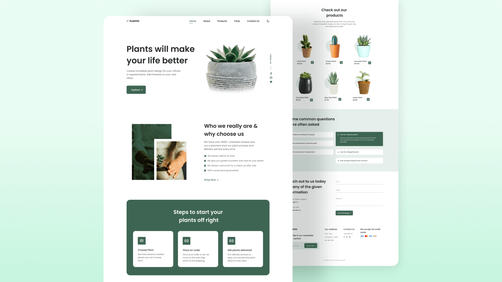

# 🌿 Responsive Plants Website

A modern and responsive Plants Website built using HTML, CSS, and JavaScript. The website features smooth scroll animations, dark/light mode, and a mobile-first design approach to ensure an excellent user experience across all devices.

## 🚀 Features

- 🌱 Beautiful and modern Plants Website UI
- 📱 Fully responsive design
- 🎨 Dark and Light mode toggle
- ✨ Smooth animations on scroll
- 📲 Mobile First methodology
- 🖥️ Desktop optimized layout
- ⚡ Interactive user interface
- 🌍 Compatible with all modern browsers

## 🛠️ Technologies Used

- HTML5
- CSS3
- JavaScript (ES6)
  
## 📂 Project Structure

```
Responsive-Plants-Website/
│
├── index.html
├── assets/
│   ├── css/
│   │   └── styles.css
│   ├── js/
│   │   └── main.js
│   └── img/
│
└── README.md
```

## 📸 Screenshots

Add screenshots of your website here.

## 🎯 Sections Included

- Home
- About
- Products
- FAQs
- Contact Us
  

## 🌙 Dark & Light Mode

Users can switch between dark and light themes for a better viewing experience.

## ✨ Scroll Animations

Elements animate smoothly while scrolling to make the website more engaging and interactive.

## 📱 Responsive Design

The website is built using the Mobile First approach and adapts seamlessly to:

- Mobile Phones
- Tablets
- Laptops
- Desktop Screens

## 🚀 Getting Started

### 1. Clone the repository

```bash
git clone https://github.com/anujkush2431393/responsive-plants-website.git
```

### 2. Navigate to the project folder

```bash
cd responsive-plants-website
```


## 👨‍💻 Author

Developed By  by Anuj Kushwaha

## 📸  Preview
  
